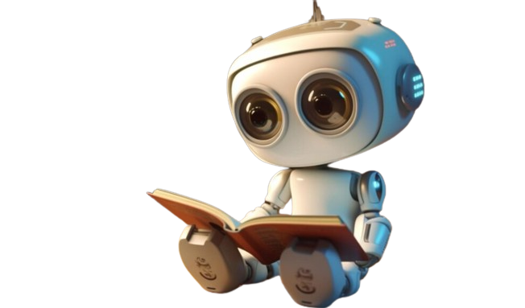

# AI Storyteller📖
Our project harnesses the power of artificial intelligence to generate captivating stories from a sequence of three images. Not only does it create a story for each image set, but it also provides a unique moral for every story it generates. A project where pictures paint a thousand words and beyond!  

## 🚀Features  
- *Image to Story Generation*: Converts a series of three images into a rich narrative.  
- *Dynamic and Engaging*: Produces unique and varied stories each time.
- *User-Friendly Interface*: Simple and intuitive design for seamless user experience.    

### A Story generated by our model

